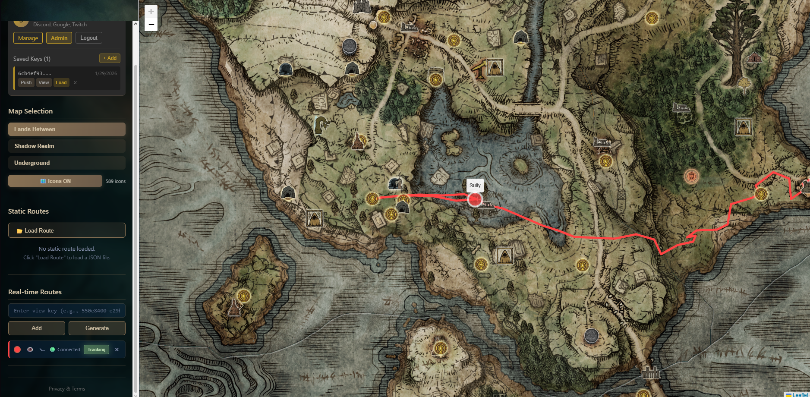

# Route Tracker - Elden Ring Mod

> **Alpha Version** - Under active development

A mod for Elden Ring that records player position to track routes, with an interactive map viewer.

**Live Viewer:** https://er-route-tracker.sulli.tech/

<p align="center">
  
  <br/>
  <em>Interactive map viewer</em>
</p>

<p align="center">
  
  <br/>
  <em>In-game overlay</em>
</p>

## Features

### Mod (In-Game Tracker)
- Display current player position (X, Y, Z, Map ID)
- Record routes with configurable interval
- Export routes to JSON files
- Real-time position streaming for live tracking
- Configurable hotkeys

### Web Viewer
- Interactive world map (Lands Between, Shadow Realm DLC, Underground)
- Load and display recorded routes
- Real-time live tracking of player position
- Location icons (graces, bosses, merchants, etc.)
- Teleportation and map transition markers

## Roadmap

### Mod
- [ ] Event tracking (item pickup, death, grace activation...)

### Website
- [ ] Event icons on map (item pickup, death, grace activation...)
- [ ] Timelapse playback mode

---

## Installation

### Required Files

Download the latest release and copy these files to the same folder:
- `route_tracking.dll`
- `route-tracker-injector.exe`
- `route_tracker_config.toml` (required!)
- `WorldMapLegacyConvParam.csv` (required for coordinate conversion)

### Prerequisites

- Elden Ring with [EAC bypass](https://soulsspeedruns.com/eldenring/eac-bypass/)

### Launch

1. Start Elden Ring (with EAC bypass)
2. Run `route-tracker-injector.exe` (as Administrator recommended)
3. The injector will wait for the game if not running, then inject automatically

---

## Usage

### In-Game Controls

Default hotkeys (configurable in `route_tracker_config.toml`):

| Hotkey | Action |
|--------|--------|
| **F9** | Toggle overlay visibility |
| **Ctrl+R** | Start/Stop recording |
| **Ctrl+S** | Save current route to JSON |
| **Ctrl+Shift+C** | Clear recorded route |
| **F6** | Start/Stop real-time streaming |

### Recording a Route

1. Press **F9** to show the overlay
2. Press **Ctrl+R** to start recording
3. Play the game - your position is recorded automatically
4. Press **Ctrl+R** to stop recording
5. Press **Ctrl+S** to save the route to a JSON file

Routes are saved in the `routes/` folder (configurable).

### Customizing Hotkeys

Edit `route_tracker_config.toml`:

```toml
[keybindings]
toggle_ui = "f9"
toggle_recording = "ctrl+r"
toggle_streaming = "f6"
save_route = "ctrl+s"
clear_route = "ctrl+shift+c"

[recording]
record_interval_ms = 100

[output]
routes_directory = "routes"
```

**Hotkey format:**
- Simple key: `"f9"`, `"a"`, `"insert"`
- With modifier: `"ctrl+f9"`, `"shift+a"`, `"alt+1"`
- Multiple modifiers: `"ctrl+shift+s"`

---

## Real-Time Streaming

Stream your position live so others can watch your route in real-time on the web viewer.

### Step 1: Get Your Keys

1. Go to https://er-route-tracker.sulli.tech/
2. Open the side panel (arrow on the left)
3. In the "Real-time Tracking" section, click **"Generate New Keys"**
4. You will receive two keys:
   - **Push Key (Writer)**: Keep this private! Used by the mod to send your position
   - **View Key (Reader)**: Share this with viewers so they can watch your route

### Step 2: Configure the Mod

Edit `route_tracker_config.toml`:

```toml
[realtime]
enabled = true
backend_url = "https://er-route-tracker.sulli.tech/"
push_key = "your-push-key-here"
```

### Step 3: Start Streaming

1. Launch the mod
2. Press **F6** to start streaming
3. Your position is now being sent to the server in real-time

### Step 4: Share Your View Key

Give your **View Key** to anyone who wants to watch your route:
1. They go to https://er-route-tracker.sulli.tech/
2. They paste your View Key in the "Real-time Tracking" section
3. They click "Add" and your route appears live on the map

---

## Viewing Routes

### Account (Optional)

Sign in to save your keys permanently and generate new tracking keys:
1. Click **"Sign In"** in the Account section
2. Choose a provider (Discord, Twitch, or Google)
3. Your keys will be saved to your account automatically

### Load Static Routes (JSON Files)

1. In the **"Static Routes"** section, click **"Load Route"**
2. Select your JSON route file
3. The route appears on the map

### Watch Live Routes

1. In the **"Real-time Routes"** section, paste a **View Key**
2. Click **"Add"**
3. The route appears and updates in real-time

**Note:** You must be signed in to generate new tracking keys.

### Route Management

For all routes (static and live), you can:
- Click the **color button** to change the route color
- Click the **name** to rename it
- Click the **eye icon** to hide/show

Static routes only:
- Click **"Focus"** to center the map on the route

Live routes only:
- Click **"Track"** to automatically follow the player on the map

### Share Your Route

To let others watch your route in real-time, you can either:

**Option 1: Share the URL directly**
- Give them the link: `https://er-route-tracker.sulli.tech/?viewKeys=YOUR_VIEW_KEY`
- The route will load automatically when they open the link

**Option 2: Share the View Key**
1. Give them your **View Key** (found in the side panel after generating keys, or in your Account page)
2. They paste it in the **"Real-time Routes"** section and click **"Add"**

The View Key is read-only - viewers can only watch, not modify your route.

### Map Navigation

- Use the **Map Selection** buttons to switch between maps
- Toggle **location icons** (graces, bosses, etc.) with the Icons button
- **Scroll** to zoom in/out
- **Click and drag** to pan

---

## License

This project is licensed under **GNU Affero General Public License v3.0** (AGPL-3.0).

This project uses code from [eldenring-practice-tool](https://github.com/veeenu/eldenring-practice-tool) by johndisandonato, also licensed under AGPL-3.0.

## Attribution

- **johndisandonato** - [eldenring-practice-tool](https://github.com/veeenu/eldenring-practice-tool)
- **veeenu** - [hudhook](https://github.com/veeenu/hudhook)
- **Smithbox** - [vawser/Smithbox](https://github.com/vawser/Smithbox)

## For Developers

- [mod/README.md](mod/README.md) - Building and developing the mod
- [website/README.md](website/README.md) - Building and developing the website

## Contributing

Contributions are welcome! All contributed code will be licensed under AGPL-3.0.
